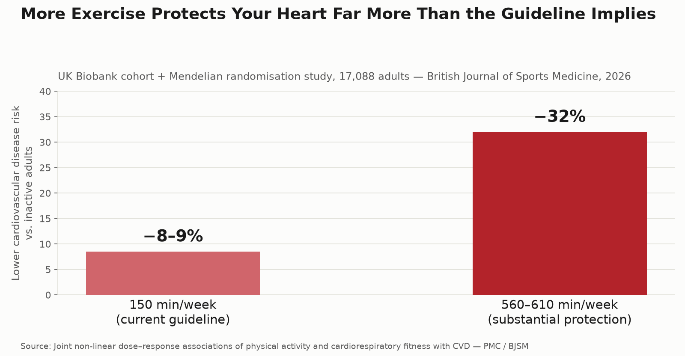

# How Much Exercise Actually Protects Your Heart? New Research Says More Than You Think

If you're hitting the standard "150 minutes of exercise a week" target and assuming your heart is well protected, new research says you're only getting a fraction of the benefit available. A large 2026 study just put a real number on how much exercise it actually takes to meaningfully cut your cardiovascular risk — and it's roughly four times higher than most guidelines suggest.

## The study: bigger, more rigorous than most

Researchers at Macao Polytechnic University analyzed data from **17,088 UK Biobank participants**, averaging 57 years old, who wore wrist-based activity trackers for seven consecutive days and completed a cycle test to estimate their cardiorespiratory fitness (VO2 max). The study then tracked who went on to develop cardiovascular disease — atrial fibrillation, heart attack, heart failure, or stroke.

What makes this study stand out is that the researchers also ran a **Mendelian randomisation analysis**, a genetics-based method that helps separate genuine cause-and-effect from the usual "people who exercise more also tend to be healthier for other reasons" problem that weakens most exercise research. That adds real weight to the findings. The study was published in the *British Journal of Sports Medicine*.

## The number that matters: 560–610 minutes

Here's the core finding: adults who hit the standard guideline of 150 minutes of moderate-to-vigorous exercise per week had only an **8–9% lower cardiovascular risk** than inactive people. Modest, but not nothing.

Adults who exercised **560 to 610 minutes per week** — roughly 80–90 minutes a day, or about 9–10 hours weekly — had a **more than 30% lower risk** of cardiovascular disease. That's a completely different order of protection, and it came from a dose 3–4 times higher than what most of us think of as "doing enough."

## Fitness level changes the equation

The study also found the relationship isn't the same for everyone. Less-fit participants needed roughly **30–50 more minutes per week** than the fittest participants to achieve the same reduction in cardiovascular risk. In other words, building your baseline fitness (VO2 max) doesn't just make exercise feel easier — it directly lowers the amount of exercise you need to protect your heart. Fitness and volume work together, not separately.

The researchers' own conclusion is worth sitting with: future guidelines may need to separate the **minimum** activity level needed for basic safety from the substantially higher volume needed for **optimal** cardiovascular protection. The current 150-minute figure was never designed to be a ceiling — it's a floor.

## What this actually means for your training

This doesn't mean 150 minutes is worthless — an 8–9% risk reduction is still real, and cardiovascular disease is only one part of overall health. But if your goal is genuinely protecting your heart long-term, not just hitting a minimum checkbox, the practical takeaways are:

1. **Treat 150 minutes as the floor, not the target.** If you're currently doing the bare minimum, there's a large amount of additional protection available by building toward 500+ minutes a week.

2. **Spread it across the week, and mix intensities.** 560–610 minutes sounds large, but across 6 days that's under 100 minutes a day — achievable through a combination of structured training sessions plus daily movement like walking, not all high-intensity gym work.

3. **Build your fitness base, not just your minutes.** Since higher cardiorespiratory fitness reduces the volume of exercise you need for the same protection, a structured strength-and-conditioning program that improves VO2 max is doing double duty — better performance and less exercise "debt" to carry.

4. **Combine strength and cardio.** This finding pairs well with other 2026 research showing that adding resistance training alongside cardio work produces stronger cardiovascular benefits than either alone — reinforcing that a well-rounded program beats chasing one type of training.

## The bottom line

The "150 minutes a week" guideline isn't wrong — it's just far more conservative than most people realize. Real cardiovascular protection looks more like a genuinely active lifestyle than a weekly checkbox, and building your underlying fitness level is what makes that volume achievable without burning out.

This is exactly why our programs at Kanhustle Fitness are built around structured weekly training rather than one-off sessions — consistent volume, built up sustainably, is what the research says actually protects your heart. If you want a plan that gets you there without guesswork, get in touch.

---
**Sources:**
- [Joint non-linear dose–response associations of device-measured physical activity and cardiorespiratory fitness with cardiovascular disease: a cohort and Mendelian randomisation study — PMC (British Journal of Sports Medicine, 2026)](https://pmc.ncbi.nlm.nih.gov/articles/PMC13479690/)
- [Study record — PubMed](https://pubmed.ncbi.nlm.nih.gov/42156172/)
- [560-610 minutes of exercise a week needed for substantial heart benefits — BMJ Group](https://bmjgroup.com/560-610-minutes-of-exercise-a-week-needed-for-substantial-heart-benefits/)
- [Scientists reveal how much exercise you really need to protect your heart — ScienceDaily](https://www.sciencedaily.com/releases/2026/08/260806050724.htm)
