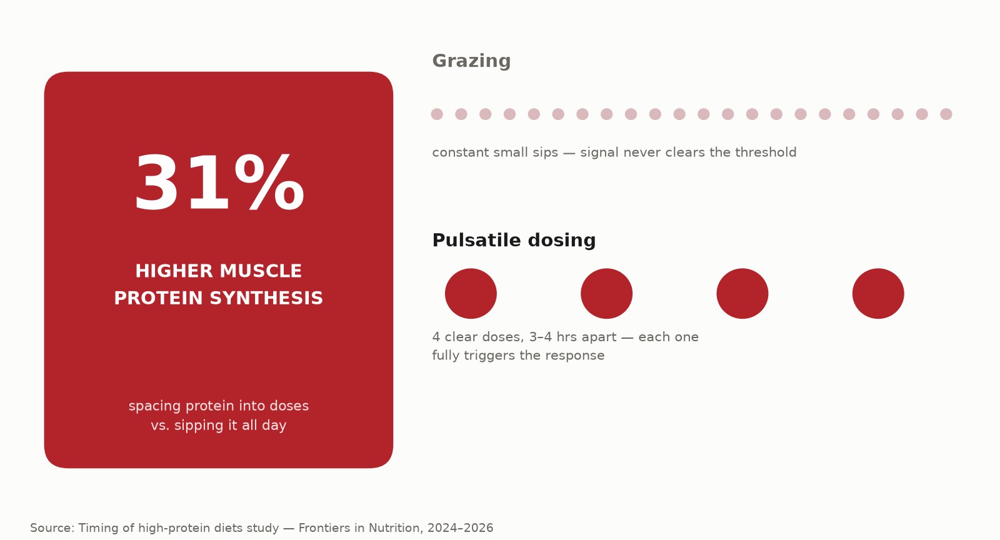

# Protein Timing, Revisited: Why When You Eat It May Matter More Than You Think

Chances are you've got a protein shake habit built around one idea: get it in fast after training. New research says the real lever might be somewhere else entirely — how you spread it across your whole day.

## The 31% number that changes the conversation

A 2026 study looked at two different ways of eating the same total protein over a 12-hour recovery window: sipping it continuously throughout the day versus eating it in distinct, separated doses. The pulsatile approach — protein in clear bolus doses spaced **3–4 hours apart** — produced **31% higher cumulative muscle protein synthesis** than continuous "grazing" on the exact same total intake.

Same amount of protein. Same person. Just a different rhythm — and a massive difference in the muscle-building signal your body actually received.

## Wait, isn't the post-workout window the whole point?

Kind of, but less than you'd think. Getting protein in within an hour or two after training does kickstart muscle protein synthesis faster — but once your total daily protein intake is already solid, that early-window bonus mostly disappears. The bigger lever turns out to be the "integrated day" approach: how your total protein is distributed across all your meals, not just the one right after the gym.

Researchers now describe the old "30-minute anabolic window" idea as mostly a myth from the 1970s. The real window is closer to **4–6 hours** of nutrient sensitivity per meal — which is exactly why eating in spaced bolus doses outperforms constant grazing: each dose gets its own full window to do its job instead of overlapping with the last one.

## What "grazing" actually looks like (and why it underperforms)

Grazing isn't a bad word for a bad habit — it's just protein shakes sipped slowly, snacking on protein bars between meals, or small amounts of protein scattered constantly through the day. It feels efficient. The research says it's actually diluting the signal: your muscles need a clear, distinct dose to meaningfully trigger protein synthesis, and a trickle never quite clears that threshold the way a real dose does.

It's an easy trap because grazing *feels* like the disciplined option — protein always on hand, never a big meal, always "on track." But muscle protein synthesis doesn't reward constant low-level presence the way willpower does. It responds to a clear signal crossing a real threshold, repeated a few distinct times a day, with enough of a gap in between for the previous dose's window to actually close.

## Four changes worth making this week

1. **Switch from grazing to 3–4 clear protein doses a day**, spaced roughly 3–4 hours apart, rather than sipping or snacking constantly.

2. **Stop obsessing over the post-workout window specifically.** A solid protein dose within a couple of hours of training is fine — it doesn't need to be the single most engineered meal of your day.

3. **Make sure each dose is a real dose, not a token amount.** A proper bolus — not a splash in your coffee — is what actually triggers the synthesis response the research is describing.

4. **Think in terms of your whole day's rhythm**, not just your training day. The "integrated day" framework applies on rest days too — muscle repair doesn't take days off just because you did.

## The bottom line

The anabolic-window panic is outdated. What the newest research actually rewards is rhythm: a handful of real, separated protein doses across the day beats constant small sipping, even at identical totals. It's a simple change — eat protein like distinct meals, not a background IV drip — with a 31% difference in the data to back it up.

Nutrition timing like this is baked into the coaching at Kanhustle Fitness — because how you eat matters just as much as how hard you train.

---
**Sources:**
- [Timing matters? The effects of two different timing of high protein diets on body composition and muscular performance — Frontiers in Nutrition](https://www.frontiersin.org/journals/nutrition/articles/10.3389/fnut.2024.1397090/full)
- [Protein Timing & Muscle Protein Synthesis: 2024–2026 Research Review — Nutrola](https://nutrola.app/en/blog/protein-timing-muscle-protein-synthesis-research-review-2024-2026)
- [Does Protein Ingestion Timing Affect Exercise-Induced Adaptations? A Systematic Review with Meta-Analysis](https://www.mdpi.com/2072-6643/17/13/2070)
