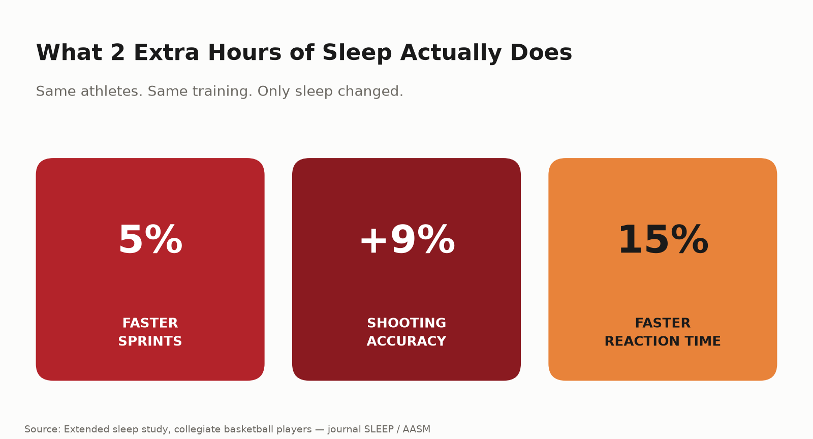

# Sleep as a Performance Tool, Not a Luxury

Quick question: if a supplement promised you 5% faster sprints, 9% better shooting accuracy, and 15% faster reaction time, you'd buy it instantly, right? That's exactly what sleep does — and it's free.

## The study that proves it

Researchers took collegiate basketball players and simply extended their sleep — no new drills, no new gear, nothing else changed. The results, published in the journal *SLEEP*, were hard to ignore:

- **Sprint times improved from 16.2 to 15.5 seconds** — roughly a 5% jump, purely from sleeping more
- **Shooting accuracy rose 9%** on both free throws and three-pointers
- **Reaction time improved by 15%**
- Players reported better mood, less daytime sleepiness, and better overall well-being

The only intervention was sleep duration — athletes added on average almost **two extra hours a night** during the study period. No extra training. No new nutrition plan. Just more sleep.

## Why this actually makes sense

Training breaks the body down. Sleep is when it rebuilds — muscle repair, hormone regulation, and the nervous-system recalibration that reaction time depends on all happen disproportionately during deep sleep. Skimping on sleep doesn't just mean feeling tired; it means showing up to the next session with the adaptation from the last one still unfinished.

And it's not just athletes who intuitively get this. A recent consumer survey found nearly **69% of people would choose 8 hours of sleep over unlimited snacks with no weight gain** — a strange hypothetical, but it says something real: people already sense sleep matters more than almost anything else, even if their actual habits don't reflect it.

## Why sleep gets skipped anyway

It's the easiest part of a training plan to sacrifice because nothing visibly breaks the next day. Miss a workout and you feel it immediately. Miss two hours of sleep and you might feel "fine" — right up until your reaction time, your decision-making, and your injury risk quietly get worse without announcing it.

Part of the problem is that sleep doesn't compete for attention the way training does. Nobody posts a video of a good night's sleep. There's no leaderboard for it, no visible "before and after." So it loses out to the things that do show up — an extra late session, one more scroll on the phone, a few more episodes before bed — even though, stat for stat, it may be doing more for performance than most of those late sessions ever will.

## Four ways to actually use this

1. **Treat sleep like a training variable, not a lifestyle footnote.** If you track sets and reps, track hours slept — it's the recovery input with the single best evidence behind it.

2. **Protect the two hours before bed.** Screens, late intense training, and heavy meals close to bedtime all push back when quality deep sleep actually starts.

3. **Prioritize consistency over heroics.** A steady 7.5–8 hours every night beats 6 hours on weekdays and "catching up" on weekends — the body doesn't bank sleep debt and repay it cleanly.

4. **Treat the week before a big match or test like a taper, not a cram session.** Cutting sleep to fit in extra late training before something important works against the exact performance you're chasing.

## The bottom line

Nobody needs convincing that training matters. Fewer people treat sleep with the same seriousness — despite research showing gains in speed, accuracy, and reaction time that most supplements can only dream of claiming. It's the most under-coached part of performance, and it's sitting right there, free, every night.

Recovery — sleep included — is built into every program at Kanhustle Fitness, because chasing more training volume without fixing sleep is leaving performance on the table for free.

---
**Sources:**
- [Extended sleep improves the athletic performance of collegiate basketball players — American Academy of Sleep Medicine](https://aasm.org/extended-sleep-improves-the-athletic-performance-of-collegiate-basketball-players/)
- [Sleep and Athletic Performance: Impacts on Physical Performance, Mental Performance, Injury Risk and Recovery — PMC](https://pmc.ncbi.nlm.nih.gov/articles/PMC9960533/)
- [Optimising Performance Through Sleep: An Evidence-Based Review — PMC](https://pmc.ncbi.nlm.nih.gov/articles/PMC13429214/)
