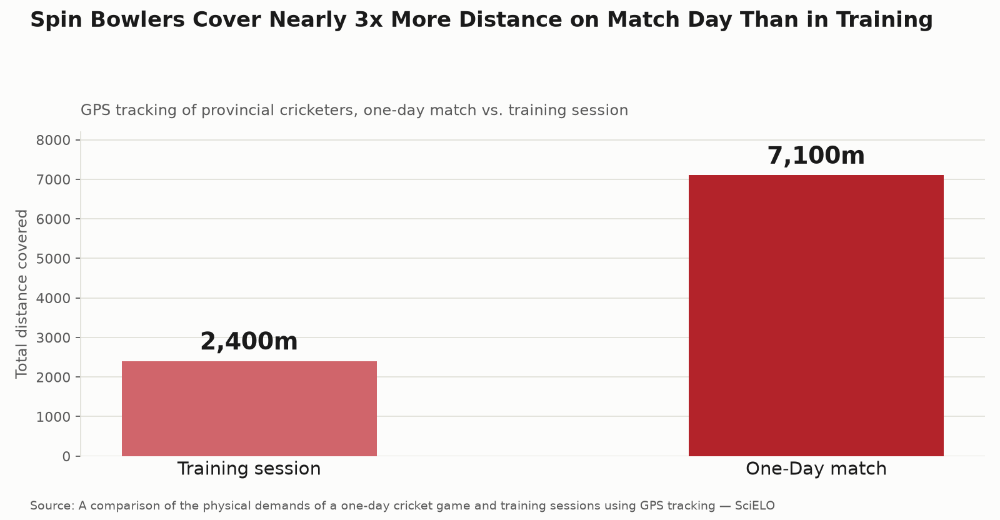

# Spin Bowlers Need Completely Different Conditioning Than Pace Bowlers

Walk into most cricket academies and the strength and conditioning program looks identical regardless of whether the bowler spins it or slings it down at 140 km/h. The research says that's a mistake — spin and pace bowling place fundamentally different demands on the body, and training them the same way shortchanges both.

## The data: spin bowlers move far more than training suggests

GPS tracking of provincial cricketers found spin bowlers covered more than **twice the total distance in a one-day match (7,100m) compared to training (2,400m)** — a huge mismatch between what training prepares them for and what they actually face on match day. Despite that larger total volume, the picture is more nuanced than "spin bowlers just run more": their high-intensity efforts (striding and sprinting) make up only around **0.5% and 2%** of their total movement respectively, and their overall work intensity is considerably lower than fast bowlers', largely due to the shorter run-up.

## Why this matters for how spinners should train

This creates a training paradox. Spin bowlers need genuine aerobic endurance to cover match-day distances comfortably across long spells — but they don't need the explosive, high-force power output that defines fast-bowling conditioning. A program built around heavy sprint work and high-force lower-body power, borrowed wholesale from pace-bowling conditioning, is solving the wrong problem for a spinner.

The research also points to a training-method gap, not just an intensity gap: traditional net sessions dramatically understate match demands, while **centre-wicket simulations** — bowling in a realistic match-like format rather than isolated net deliveries — produce movement patterns much closer to actual game intensity. If a spinner trains almost exclusively in the nets, their conditioning is being built against the wrong stimulus entirely.

## The practical gap in most programs

Fast-bowling research dominates cricket conditioning content for an obvious reason: fast-bowling injuries are dramatic and well-studied. But that leaves spin bowling as a genuine research and coaching gap — a discipline with its own distinct physical profile that rarely gets its own dedicated plan, especially at age-group and club level where "bowling conditioning" usually just means generic fitness work.

## Four training priorities specific to spin bowling

1. **Build aerobic base deliberately.** Long spells across a full day demand genuine cardiovascular endurance — steady-state running and extended bowling-specific conditioning blocks matter more here than for pace bowlers.

2. **Train in match-realistic formats, not just nets.** Centre-wicket simulations and game-based training sessions replicate actual match intensity far better than standard net sessions — and should make up a real share of a spinner's conditioning work, not just skill work.

3. **Don't copy fast-bowling power programs wholesale.** Heavy emphasis on maximal lower-body power and sprint mechanics addresses a demand spinners don't face to the same degree — better to prioritize repeat-effort endurance and rotational control for consistent, accurate deliveries over a long spell.

4. **Manage total overs across the full day, not just per spell.** Because match-day volume so dramatically exceeds training volume, workload tracking for spinners should account for the full day's bowling load, not just isolated bursts.

## The bottom line

Spin bowling isn't just "fast bowling at lower effort" — it's a distinct physical discipline with its own demands: more total distance, far less high-intensity output, and a heavy reliance on aerobic endurance over explosive power. Training spinners on a program built for quicks addresses the wrong problem.

This is exactly the kind of role-specific detail our conditioning programs at Kanhustle Fitness are built around — treating spin bowling as its own discipline, not a lighter version of pace bowling. If your spinner's training still looks identical to the quicks', that's worth fixing before the next long spell.

---
**Sources:**
- [A comparison of the physical demands of a one-day cricket game and training sessions using GPS tracking — SciELO](https://scielo.org.za/scielo.php?script=sci_arttext&pid=S1015-51632018000100019)
- [Strength and Conditioning for Cricket Spin Bowlers — NSCA Strength & Conditioning Journal](https://www.researchgate.net/publication/350622452_Strength_and_Conditioning_for_Cricket_Spin_Bowlers)
- [A review of the physical and physiological demands associated with cricket fast and spin bowlers](https://journals.sagepub.com/doi/10.1177/1747954117731051)
