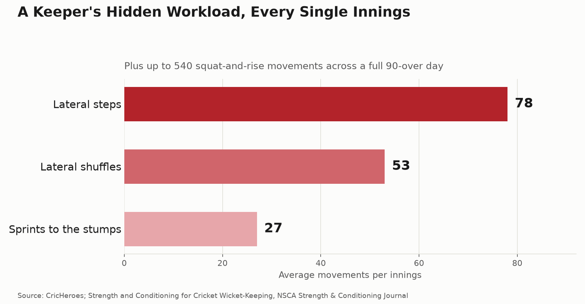

# Wicket-Keeping Fitness: The Hidden Endurance Event of Cricket

Ask a cricket parent which position demands the most fitness and most will say fast bowler. Few would say wicket-keeper — yet the data says otherwise. A keeper performs roughly **78 lateral steps, 53 lateral shuffles, and 27 sprints to the stumps per innings**, and squats down and rises back up as many as **540 times across a 90-over day**. That's not a support role. That's an endurance event disguised as a standing-still job.

## Why keeping is physically brutal in a way that's easy to miss

The demands are almost entirely invisible on a scorecard. Every single ball — all 540 of them in a full day's play — requires the keeper to drop into a crouch, track the ball, and explosively reset, regardless of whether anything actually happens. On top of that baseline load sits the lateral movement: constant small shuffles to stay aligned with the stumps, bigger lateral steps to cover width, and sprints to the stumps for run-out chances or back-up throws.

A narrative review in the *Strength & Conditioning Journal* identifies the core physical qualities this demands: **multidirectional speed, change-of-direction ability, lower-limb power, and aerobic fitness** — a genuinely different profile from a fast bowler's power-and-recovery demands or a batter's rotational-power needs. Keeping is closer to a repeated-effort endurance sport layered on top of elite reflexes.

## The reflex side of the job

Beyond the movement volume, keepers need to react to edges traveling at 80–90 mph from a standing start just 22 yards away — a reaction window measured in milliseconds, repeated hundreds of times across a day, on tired legs by the final session. Mobility is the foundation that makes any of this possible: if a keeper can't get into a comfortable, balanced crouch, the reflexes and footwork built on top of it never get a fair chance to work.

## Why this role gets skipped in training

Despite the physical demand being arguably higher than any other fielding position, keeper-specific conditioning is rare. Most training plans default to generic fielding drills, assuming a keeper's skill work (glovework, standing up to spin) covers the fitness side too. It doesn't — glovework builds hands, not the hips, ankles, and aerobic base that 540 squats a day actually requires.

## Four ways to train for the real demands of keeping

1. **Build squat-specific muscular endurance, not just squat strength.** High-rep bodyweight and goblet squat work, and tempo squats under fatigue, mirror the repeated-crouch demand far better than heavy low-rep lifting alone.

2. **Prioritize hip and ankle mobility before anything else.** A keeper who can't comfortably hold a low stance will compensate with poor posture that limits reaction speed — mobility work isn't optional pre-season content, it's the foundation everything else sits on.

3. **Train lateral movement specifically.** Shuffles and lateral bounds under fatigue — not just forward-backward sprint work — directly replicate the 53 shuffles and 78 steps per innings the position actually demands.

4. **Condition for a full day, not a single session.** Because the squat-and-reset demand repeats for every ball across 90 overs, conditioning blocks should build toward sustained output across a full simulated day, not just short high-intensity bursts.

## The bottom line

Wicket-keeping is one of the most physically demanding roles in cricket, and one of the least specifically trained. The movement data makes the case plainly: this isn't a position that gets fit by playing more matches — it needs its own dedicated conditioning, built around squat endurance, lateral speed, and mobility.

If your keeper's training still looks identical to everyone else's fielding drills, that's the gap our programs at Kanhustle Fitness are built to close — position-specific conditioning for the role that quietly works harder than almost any other on the field.

---
**Sources:**
- [Strength and Conditioning for Cricket Wicket-Keeping: A Narrative Review — NSCA Strength & Conditioning Journal](https://www.researchgate.net/publication/379905653_Strength_and_Conditioning_for_Cricket_Wicket-Keeping_A_Narrative_Review)
- [Mastering Wicket Keeping in Cricket — CricHeroes](https://blog.cricheroes.com/wicket-keeping-in-cricket/)
- [Fitness as a Wicket-Keeper — Cricket World](https://www.cricketworld.com/fitness-as-a-wicket-keeper/61030.htm)
