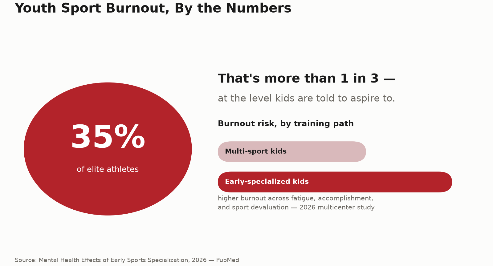

# Youth Sport Burnout: Why Early Specialization May Be Quietly Hurting Young Athletes

Your 12-year-old plays one sport, year-round, and everyone tells you that's how you build a champion. New research says: maybe slow down.

## The study that should make every sports parent pause

A 2026 multicenter study looked at college athletes and asked a simple question: does specializing in one sport early actually pay off mentally, long-term? The answer wasn't great. Athletes who specialized early reported **significantly higher burnout across the board** — more physical and psychological fatigue, a weaker sense of accomplishment, and something researchers call "sport devaluation," which is basically falling out of love with the thing you used to love.

And this isn't a fringe problem. Separate research puts the number at roughly **35% of elite athletes** dealing with mental health symptoms like anxiety, depression, or burnout. That's more than 1 in 3 — at the level kids are told to aspire to.

## Why "more reps, earlier" doesn't just mean "better, sooner"

The logic behind early specialization feels obvious: more hours in one sport should mean faster skill development. And in the short term, it often does. But burnout research keeps finding the same pattern — specialized athletes show up to training with less enjoyment and less motivation than multi-sport athletes, even when they're objectively more skilled. Skill and psychological health aren't the same curve, and pushing one doesn't automatically protect the other.

There's a physical cost layered on top, too. The same single-sport repetition that builds skill also repeats the exact same movement patterns thousands of times with no variation — which is a big part of why overuse injuries cluster so heavily in early-specialized young athletes. The two problems feed each other: a nagging overuse injury chips away at enjoyment, and declining enjoyment makes the next injury feel heavier to push through, rather than just a normal setback on the way to getting better.

## What this actually looks like day to day

Burnout in a 13-year-old rarely looks like a dramatic breakdown. It looks like:
- Dragging their feet to a practice they used to run to
- Getting irritable or flat after sessions instead of energized
- Performing fine technically while clearly checked out emotionally
- A slow drift from "I want to" to "I have to"

None of those show up on a stat sheet. That's exactly why it's easy to miss until a kid quits the sport entirely — which is the single most common endpoint of unaddressed burnout.

## What actually helps

1. **Build in genuine off-season time.** Not "light training" — actual time away from the sport's specific movements and pressure.

2. **Encourage a second activity, even a casual one.** Multi-sport kids consistently show lower burnout scores — it doesn't need to be competitive, it just needs to be different.

3. **Watch enjoyment, not just performance.** A dip in how much a kid wants to show up is a much earlier warning sign than a dip in how they perform once they're there.

4. **Separate identity from the sport.** Athletes whose sense of self is entirely wrapped up in one sport take burnout the hardest, because a bad season doesn't just feel like a bad season — it feels like a personal failure.

## The bottom line

Early specialization can build skill faster. The research says it often builds burnout faster too — and burnout, unlike a skill gap, tends to end careers rather than extend them. The goal isn't less commitment. It's making sure the commitment is still coming from the kid, not just the schedule.

At Kanhustle Fitness, our coaching is built around long-term athletic development, not just short-term results — because a 12-year-old who still loves the game at 18 beats one who burned out at 15, every time.

---
**Sources:**
- [Mental Health Effects as a Consequence of Early Sports Specialization in College Athletes: A Multicenter Study — PubMed](https://pubmed.ncbi.nlm.nih.gov/42533305/)
- [Burnout, recovery, and flow in youth high-performance athletes — Frontiers in Psychology, 2026](https://www.frontiersin.org/journals/psychology/articles/10.3389/fpsyg.2026.1835056/full)
- [Overuse Injuries, Overtraining, and Burnout in Young Athletes — American Academy of Pediatrics](https://publications.aap.org/pediatrics/article/153/2/e2023065129/196435/Overuse-Injuries-Overtraining-and-Burnout-in-Young)
